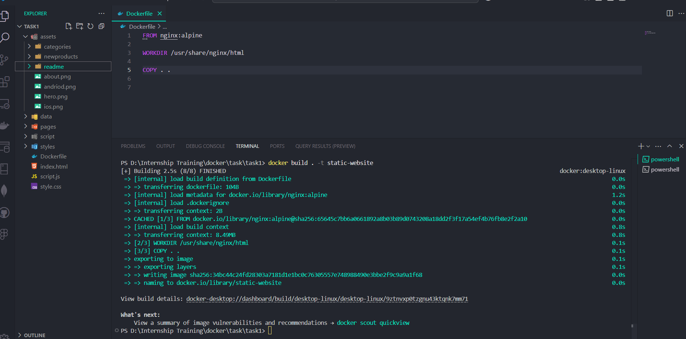
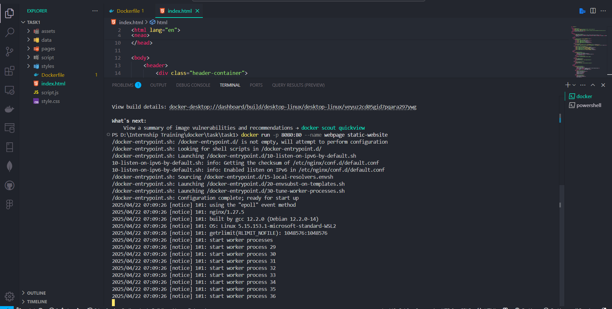

# Task - Deploying the Static Webpage Using Nginx

- Create a static webpage, Containerize it by creating a docker file and host it in a nginx image.

## Commands Learned

- To `pull` the docker image from dockerhub. It only downloads the nginx from dockerhub to local system.

` docker pull ngnix`

- To download the image and run it as a single command. Initially it will check for the given image is already download in the local system if not it will download image from hub and runs it.

` docker run nginx`

- To list of the running container and stopped container.

`docker ps`
`docker ps -a`

- To stop the running container
  ` docker stop <container_id>`

- To list of the images present in the docker

`docker images`

- To remove the image container and docker image.

`docker rm <container_id || container_name>`

`docker rmi <image_name> `

- To download the particular version or tag of the docker image.

`docker run <image_name>:<tag-name>`

- To run the image in detached mode.

` docker run -d <container_id>`

- To attach the detached running image.

` docker attach <container_id>`

- Mapping a Docker host port to access it on public.

` docker run -p <custom_port>:<dockerhost_port> <image_name>`

- Mounting a volume to store the container data. if we are stopped the running container then again running, the data stored in volume will help us to restore our work or data.

`docker run -v C:/Users/poova/Downloads/docker_data:/usr/share/nginx/html`

- To view the logs of the container

`docker logs <container_name>`

## Deploying the Static Webpage Using Nginx

- Created a Simple ecommerce website and added a `Dockerfile` to build an docker image.
- Docker file Code Snippets.

```
# Installs the Latest version of nginx
FROM nginx:latest

# Mentions the working directory of nginx
WORKDIR /usr/share/nginx/html

# Copy all the code files inside the nginx directory.
COPY . .

```

- To build the docker image

`docker build . -t static-website`



- To run the docker image with port mapping and custom container name.

`docker run -p 8080:80 --name webpage static-website`



- To mount a volume 

`docker run -p 8080:80 -v c:/users/data/docker:/usr/share/nginx --name webpage static-website`

## Demo of the Deployed Website


## Summary of the Task

- Creating a static webpage and converting that to an docker image with help of `Dockerfile`.
- Based on the steps presents in the `Dockerfile` it will create the image.
- Initially it will install nginx latest version.
- Then copies the present working directory code files to nginx directory.
- When we run the nginx image a continer will be created and by using a port mapping we are to access the hosted static webpage outside of the docker hosts.
