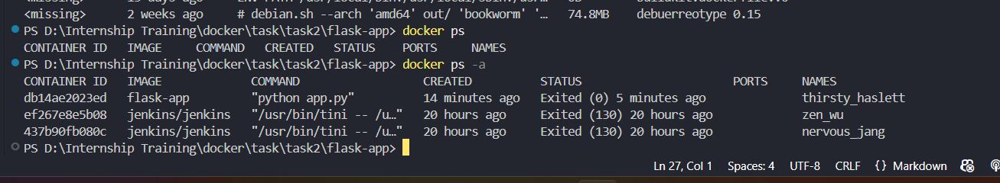

# Task - Create Python Flask Web App and Working with Dockerfile and Docker Image

- Creating a Python Flask web application and writing a Dockerfile to containerize it, and running it as a standalone container.

## Commands Executed

- To build a image based on the `Dockerfile` with a custom tag name.

``` docker build . -t flask-app```


- To run the builded docker image with port mapping. Port mapping helps to access the application at any browser publicly.

``` docker run -p 8080:5000 flask-app```


- To view the running status of containers.

``` docker ps ```


- To view the both running and stopped containers.
``` docker ps -a ```



- To delete the particular contianer using a container Id, name etc.

``` docker rm <container_id> ```
``` docker rm <container_name> ```


- To view the images present in the docker.

``` docker images```


- To delete the image from docker using a image name.
``` docker rmi <image-name>```


## Docker File

- Initially uses a `python:3.12-slim` as a base image.
- Set the working directory in the container.
- Copy the app.py and rest of the files inside the contianer.
- Installing the `python flask` .
- Expose the port that Flask will run on.
- Running the flask app.

```
FROM python:3.12-slim

WORKDIR /app

COPY . .

RUN pip install flask

EXPOSE 5000

CMD ["python", "app.py"]
```

## Application Demo


## Task Summary

- Learned how a containerize the application with the help of Dockerfile which acts as a instruction to set up the environment. Also learned how to map the port to view the application outside of docker hosts.