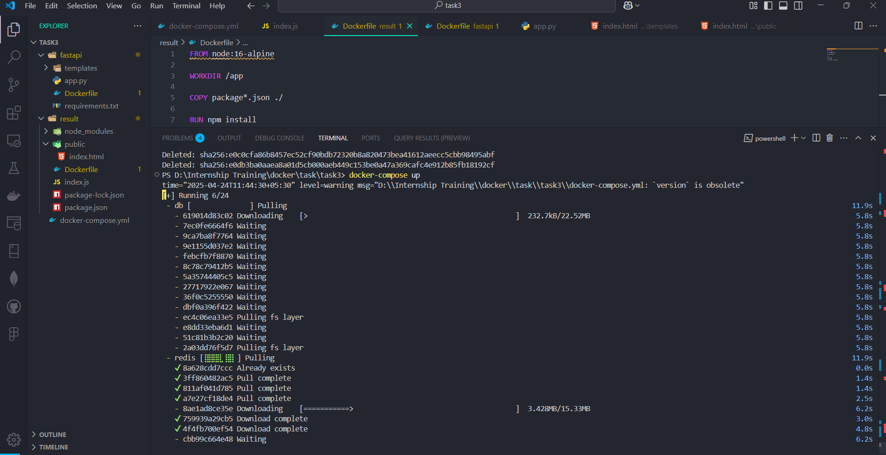

# Task - Orchestrate a Flask + Redis App with Docker Compose

- This project demonstrates a multi-stack vote casting application orchestrated using Docker Compose. It showcases how to build and run services using Python Flask, Redis, .NET, PostgreSQL, and Node.js in an integrated containerized environment.

## Project Folder Structure

```
task3/
│ 
├── assets                   # contains the assets for readme file.
├── fastapi                  # frontend application to cast a vote.
├── RedisToPostgres/         # .NET service: Redis to PostgreSQL
├── fastapi/                 # Flask API service
│   └── vote_db.sql          # Initial schema for PostgreSQL
├── result/                  # Node.js results display service
├── docker-compose.yml       # Contains the docker image name and other configuration details
```

## Docker Compose

- The application allows users to cast votes via a Flask API, store the vote counts temporarily in Redis, periodically transfer those votes to PostgreSQL using a .NET background service, and finally display the aggregated results through a Node.js frontend.

| Component       | Stack Used        | Role                                   |
| --------------- | ----------------- | -------------------------------------- |
| Vote API        | Python + Flask    | Accept and store votes in Redis        |
| In-Memory Store | Redis             | Store live vote counts                 |
| Sync Service    | .NET Core         | Transfer data from Redis to PostgreSQL |
| Database        | PostgreSQL        | Persist final vote counts              |
| Result Viewer   | Node.js + Express | Display final vote results             |
| Orchestration   | Docker Compose    | Manage and run all services            |

- Docker Compose simplifies managing multi-container Docker applications. Instead of running each container manually, you can define everything in a single `docker-compose.yml` file and bring the stack up with one command.

```
version: '3.8'

services:
  redis: # image name
    image: redis # image needed to download with version.
    ports:
      - "6379:6379"  # Port that docker hosts needed to run.

  db:
    image: postgres:9.5
    environment:
      POSTGRES_USER: postgres
      POSTGRES_PASSWORD: postgres
      POSTGRES_DB: vote_db
    ports:
      - "5432:5432"
    volumes:
      - ./fastapi/vote_db.sql:/docker-entrypoint-initdb.d/vote_db.sql

  worker:
    build:
      context: ./RedisToPostgres
    depends_on:
      - redis
      - db

  fastapi:
    build:
      context: ./fastapi
    ports:
      - "5000:80"
    depends_on:
      - redis
      - db
    environment:
      - REDIS_HOST=redis
      - DB_HOST=db

  result:
    build:
      context: ./result
    ports:
      - "5001:5001"
    depends_on:
      - db
    environment:
      - DB_HOST=db
```

## How It works

- Flask API (fastapi service) lets users cast votes. Votes are stored in Redis.
- Redis holds live vote counts.
- .NET Worker (worker service) runs in the background, reading from Redis and pushing to PostgreSQL.
- PostgreSQL database (db service) persists the vote results.
- Node.js App (result service) fetches and displays the final results.

## To Run the Docker-compose file

`docker-compose up `

- It runs and build the application image.

## Demo




